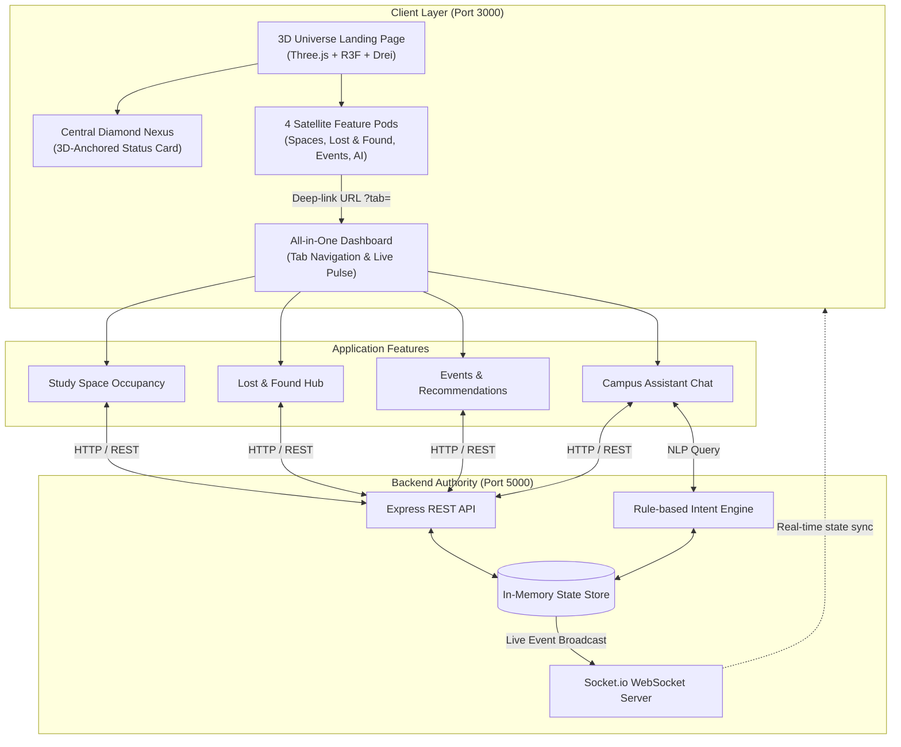

# 🎓 Campus Companion — Next-Gen Student Experience Platform
### Comprehensive Project Overview & Technical Architecture

---

## 📌 Executive Summary

**Campus Companion** is an all-in-one real-time web platform engineered to eliminate everyday campus friction for students, faculty, and administrators. It unifies four mission-critical campus domains into a single cohesive experience:

1. **Live Study Space & Lab Occupancy Tracker** — Real-time monitoring and toggling of quiet study zones, labs, and collaborative halls.
2. **Interactive Campus Heatmap & Acoustic Telemetry (Digital Twin)** — Real-time ambient decibel (dB) noise tracking, thermal crowd heat mapping, available AC power outlets, and AI 1-click spot pathfinding.
3. **Lost & Found Verification Hub** — Centralized reporting, browsing, and authenticated claiming of lost property.
4. **Campus Events & Workshop Feed** — Dynamic discovery of upcoming hackathons, tech talks, and cultural fests with one-click calendar sync.
5. **Intelligent Campus AI Assistant** — Natural language query interface connected directly to real-time database state and acoustic sensors.

The platform greets students with an interactive **3D Campus Galaxy** built in Three.js and React Three Fiber, harmonized with a sleek **glassmorphic dashboard**.

---

## 🎯 The Problem Statement

On modern university campuses, student logistics are fragmented and inefficient:
- **Wasted Study Time**: Students walk between buildings during midterms and finals only to find every study room occupied.
- **Lost Property Chaos**: Missing items are scattered across informal WhatsApp groups, hostel bulletin boards, and multiple administrative desks with no tracking.
- **Information Silos**: Events, club workshops, and hackathons are posted on social media or email chains that students easily miss.
- **Support Lag**: Campus offices have limited hours; students asking simple questions about policies or building hours face delays.

---

## 💡 The Solution: Campus Companion

Campus Companion solves these problems through an integrated, high-performance architecture:

---

## 🚀 Key Innovations & Architectural Highlights

### 1. Interactive 3D Campus Universe
- **Zero React Re-render Animation Loop**: 3D meshes and lights are animated via GPU-accelerated `useFrame` loops, preventing unnecessary React virtual DOM reconciliation and ensuring a locked **60 FPS**.
- **3D-Anchored UI Projection (`<Html>`)**: Using `@react-three/drei`, glassmorphic cards are anchored directly above 3D models in 3D coordinate space. As the camera orbits or zooms, the cards rotate, scale, and tilt with true perspective depth.
- **Central Diamond Nexus**: The centerpiece of the galaxy features a rotating 3D crystal diamond with orbiting holographic rings and live pulse indicators.

### 2. Deep-Linked Tab Routing
- Clicking any 3D pod on the landing page instantly routes to `/dashboard?tab=<tab_name>` using `useSearchParams()`.
- Users can switch tabs, share direct links to specific tools, or return to the 3D scene with the `🪐 3D Universe` button.

### 3. Real-Time Multi-User Synchronization
- Integrated with **Socket.io** on the backend.
- When an administrator or student toggles room occupancy or reports a lost item, real-time events (`spacesUpdate`, `lostItemsUpdate`, `eventsUpdate`) propagate instantly to all connected clients without page reloads.

### 4. Context-Aware Campus AI Assistant
- Built with a specialized natural language parser (`processChatMessage()`).
- Rather than providing generic canned responses, the assistant inspects live data:
  - *"Where can I study?"* $\rightarrow$ dynamically returns names of currently unoccupied rooms.
  - *"Did anyone find my keys?"* $\rightarrow$ scans the active lost registry and reports location/timestamps.
  - *"What events are on today?"* $\rightarrow$ checks current timestamps and outputs upcoming schedules.

---

## 🛠️ Complete Technology Stack

| Layer | Technologies Used | Key Purpose |
| :--- | :--- | :--- |
| **3D Graphics** | Three.js, `@react-three/fiber`, `@react-three/drei` | Interactive 3D campus galaxy, orbit controls, custom geometries |
| **Frontend Framework** | React 19, TypeScript, Vite | Modern UI, ultra-fast HMR, strict type safety |
| **Routing** | React Router v7 | Deep-linking, search parameters synchronization |
| **Design & Styling** | Vanilla CSS Glassmorphism, Google Fonts (`Plus Jakarta Sans`, `Inter`) | Modern frosted glass cards, smooth animations, WCAG contrast |
| **Backend API** | Node.js, Express 5, CORS | RESTful API endpoints for spaces, items, events, chat |
| **Real-time Engine** | Socket.io | Bi-directional WebSockets for live campus broadcasting |
| **ID & Utilities** | UUID v4 | Unique tracking IDs for lost items and events |

---

## 📡 API Specification Summary

| Method | Endpoint | Description | Request Body / Params |
| :--- | :--- | :--- | :--- |
| `GET` | `/api/spaces` | List all study spaces & occupancy | None |
| `PATCH` | `/api/spaces/:id` | Toggle space occupancy status | `{ occupied: boolean }` |
| `GET` | `/api/telemetry` | Real-time digital twin & acoustic noise zones | None |
| `POST` | `/api/telemetry/simulate` | Pitch simulation trigger (rush / quiet / reset) | `{ mode: "rush" \| "quiet" \| "reset" }` |
| `GET` | `/api/lost` | List all reported lost/found items | None |
| `POST` | `/api/lost` | Report newly lost or found property | `{ title, description, location }` |
| `PATCH` | `/api/lost/:id` | Update item status (e.g. claim item) | `{ status: "claimed" }` |
| `GET` | `/api/events` | List all upcoming campus events | None |
| `GET` | `/api/events/recommend` | Top recommended upcoming events | None |
| `POST` | `/api/events` | Create a new campus event | `{ title, description, startsAt, ... }` |
| `POST` | `/api/chat` | Query the AI Campus Assistant (spaces, quiet spots, items) | `{ message: string }` |

---

## 🔮 Scalability & Future Roadmap

1. **IoT Sensor Integration**:
   - Integrate with PIR motion sensors, desk load cells, and Wi-Fi access point client densities to automate room occupancy updates with zero human intervention.
2. **Advanced RAG (Retrieval-Augmented Generation) LLM**:
   - Upgrade the rule-based `/api/chat` endpoint to connect with Gemini 1.5 / Claude / OpenAI APIs, indexed against official university handbooks, syllabus docs, and campus navigation maps.
3. **Turnstile & RFID Authentication**:
   - Scan student ID cards via NFC/RFID at library turnstiles to automatically check in and release desk reservations.
4. **Mobile PWA & Push Notifications**:
   - Progressive Web App support with service workers for push notifications when a claimed item matches a student's lost report.

---

## 👥 Hackathon Team & Presentation Guide

- **Live Frontend**: `http://localhost:3000/`
- **Backend API**: `http://localhost:5000/`
- **GitHub Repository**: [Gautam369-web/Campus-Life-Student-Experience](https://github.com/Gautam369-web/Campus-Life-Student-Experience)
